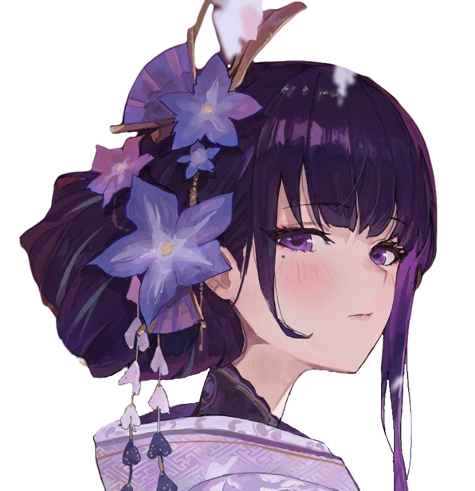
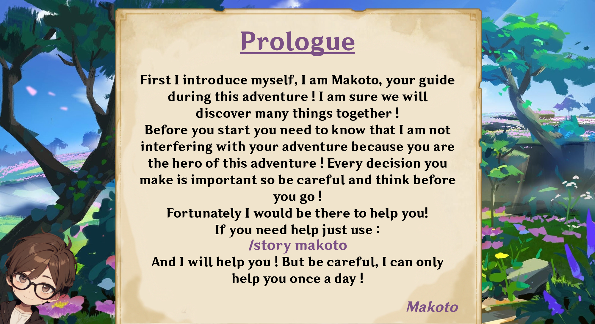

 

   

  <h3 align="center">Raijin Discord Bot</h3>

  

    Have you ever wanted to live an New Inazuma Adventure on Discord ?
     
    An Unofficial Genshin Impact Discord Bot by Makoto#7116
     
    <!--<a href="https://raidenshogun.gitbook.io/docs"><strong>Documentation</strong></a>--><a href="https://discord.gg/2AePNcphrs"><strong>Discord Server</strong></a>
     
     
  

## Discover Raijin

Hello Adventurer ! I'm Raijin, your new Discord bot companion (You can't choose). Inspired by the real Genshin Impact game, my mission is to bring a fresh adventure to your Discord experience. I can even fetch your personal information from the real game. Embark on a new journey with me and our guide (His name is Makoto) as we explore a new island inspired by Genshin Impact. Get ready for an exciting adventure !
Your going to:
- Complete quests and chapters
- View your daily quests
- Heal yourself by using statues of the seven
- Meet bosses and fight them
- Collect materials and earn characters to be more powerful in battle !

  

## Good to know

⚠️ **STILL IN DEVELOPMENT, NOT FINISHED YET**

⚠️ Stable version are only RELEASES files and not those of the main branch

⚠️ DISCLAIMER : I'm a Student Developer that create this by himself. My code work but can be very different from many advanced bots

## Supported languages

🇫🇷 **Français**

🇬🇧 **English**

## Languages used

Using :

[![Json][JSON]][JSON-url]
[![Mysql][MySQL]][MySQL-url]

## Contact

For any questions we invite you to join us on the [Discord Server](https://discord.gg/2AePNcphrs).

Also you can post your issue if you have one on this repository issue page.

[JSON]: https://img.shields.io/badge/Json-f7df1e?style=for-the-badge&logo=json&logoColor=383838
[JSON-url]: https://json.org/

[MySQL]: https://img.shields.io/badge/MySQL-005B75?style=for-the-badge&logo=mysql&logoColor=F3A01F
[MySQL-url]: https://www.mysql.com/
